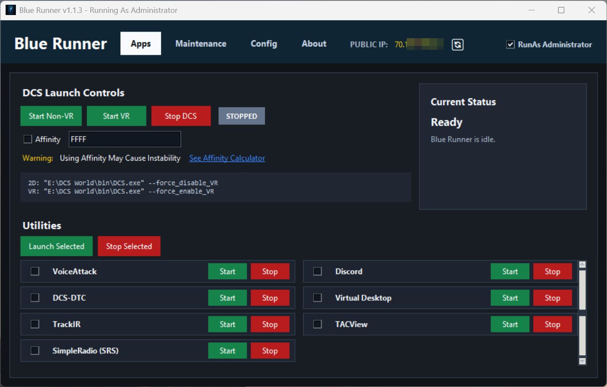
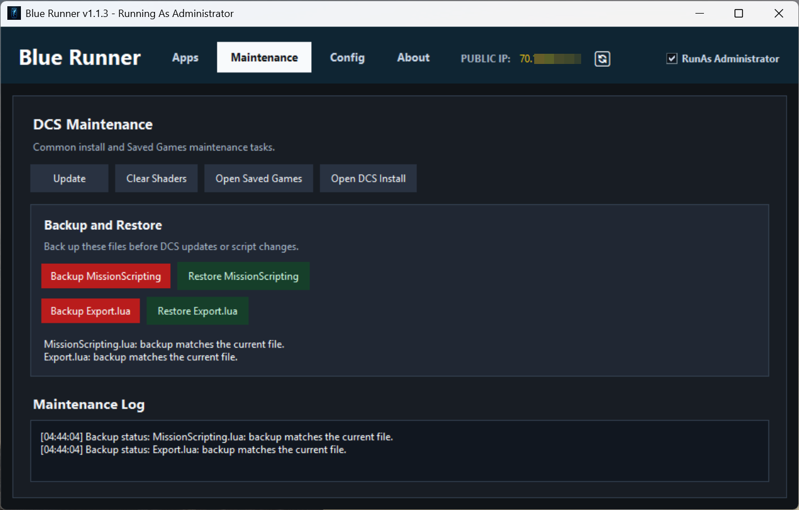
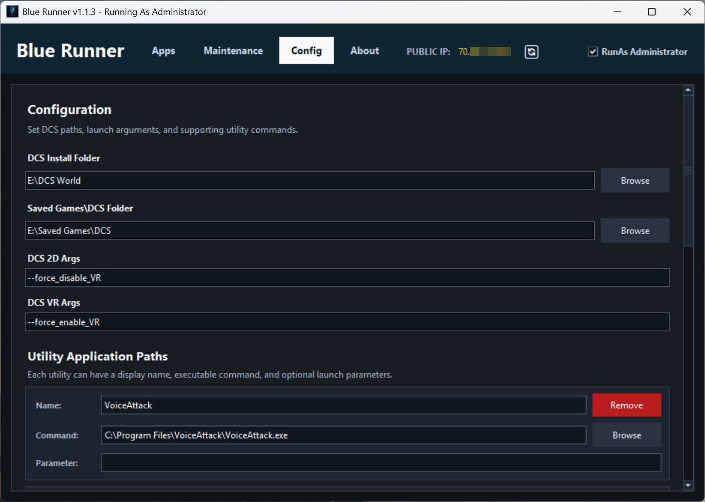

# 🚀 Blue Runner

    

> **A streamlined Windows launcher and utility manager built for DCS World pilots.**

Blue Runner brings your essential DCS applications, launch options, and maintenance tools together in one clean interface.

Instead of opening multiple programs, browsing through folders, and remembering maintenance procedures before every flight, Blue Runner gives you one central control panel to prepare your system and get flying.

---

## ✨ Features

### 🎮 Application Launcher

Launch and manage your essential DCS applications from one place.

Blue Runner can manage applications such as:

* 🎙️ VoiceAttack
* 💬 Discord
* 🎯 DCS-DTC
* 🖥️ Virtual Desktop Streamer
* 🎥 TrackIR
* 📡 SimpleRadio Standalone (SRS)
* 📊 Tacview
* 🛠️ Custom user-configured applications

Applications can be:

* Enabled or disabled individually
* Launched individually
* Closed individually
* Started together using **Launch Selected**
* Closed together using **Close Selected**
* Monitored for running or stopped status

---

## 🥽 DCS Launch Modes

Blue Runner provides dedicated launch options for different DCS configurations.

### 🖥️ Start DCS 2D

Launches DCS in standard monitor mode using:

`--force_disable_VR`

### 🥽 Start DCS VR

Launches DCS directly in VR mode using:

`--force_enable_VR`

No more manually changing VR settings before launching DCS.

---

## ⚙️ CPU Affinity Support

Blue Runner includes optional CPU affinity control for DCS World.

This allows advanced users to:

* Enable or disable CPU affinity
* Configure a custom affinity mask
* Automatically launch DCS using the configured processor affinity

> ⚠️ CPU affinity configuration is intended for advanced users. Incorrect settings may reduce performance.

---

## 🧹 DCS Maintenance Tools

Blue Runner includes commonly used DCS maintenance functions.

Available tools include:

* 🔄 Update DCS World
* 🧹 Clear DCS shader cache
* 📂 Open DCS installation folder
* 📁 Open DCS Saved Games folder
* 💾 Backup `MissionScripting.lua`
* ♻️ Restore `MissionScripting.lua`
* 💾 Backup `Export.lua`
* ♻️ Restore `Export.lua`

> 💡 Always create backups before performing major DCS updates or modifying configuration files.

---

## 🔧 Configuration

Blue Runner provides a configuration interface for managing application and DCS paths.

Configurable options include:

* 📁 DCS installation directory
* 📁 DCS Saved Games directory
* 🚀 Application executable paths
* 📝 Application command-line arguments
* ⚙️ CPU affinity settings
* 🎮 Application startup selections

Configuration settings are stored automatically and restored when Blue Runner starts.

---

## 🖼️ Screenshots

---

## 📦 Installation

### Recommended Installation

1. Open the **Releases** section of this repository.
2. Download the latest Blue Runner installer.
3. Run the installer.
4. Follow the installation prompts.
5. Launch Blue Runner from the Start Menu or Desktop shortcut.

> 🛡️ Blue Runner may request Administrator privileges because some DCS maintenance and launch functions require elevated permissions.

---

## 🚀 First Run

When Blue Runner starts for the first time:

1. Open the **Config** tab.
2. Verify your DCS installation path.
3. Verify your DCS Saved Games path.
4. Configure the applications you want Blue Runner to manage.
5. Enable the applications you want included in **Launch Selected**.
6. Save your configuration.
7. Return to the **Apps** tab and launch your flight environment.

---

## 🗂️ Default Installation Location

The recommended installation structure is:

`C:\BlueZone Tools\Blue Runner`

If an existing **BlueZone Tools** directory is detected on another drive, the installer may use that location automatically.

Users may also select a custom installation directory.

---

## 🔒 Administrator Rights

Some Blue Runner functions may require elevated Windows permissions.

Administrator access may be required for:

* Starting certain applications
* Closing protected processes
* Running DCS maintenance operations
* Updating protected files
* Managing files inside protected directories

If administrator access is declined, some features may not function correctly.

---

## 🛡️ Safety and Backups

Blue Runner includes backup and restore tools for important DCS configuration files.

Before:

* Updating DCS
* Installing major modifications
* Changing scripting configuration
* Modifying export integrations

Create a backup of your configuration files.

Blue Runner is designed to make these operations easier, but users should always maintain independent backups of important DCS files and configurations.

---

## 🖥️ System Requirements

* 🪟 Windows 10 or Windows 11
* ✈️ DCS World
* 💾 Approximately 100 MB of available storage
* 🔐 Administrator privileges for selected features

Optional supported applications may include:

* VoiceAttack
* Discord
* DCS-DTC
* Virtual Desktop Streamer
* TrackIR
* Tacview
* SimpleRadio Standalone

---

## 🛠️ Built With

Blue Runner is developed using:

* 🐍 Python
* 🖼️ Tkinter
* 🪟 Windows APIs
* 📦 PyInstaller

---

## 🐞 Bug Reports

Found a problem?

When reporting an issue, please include:

* Blue Runner version
* Windows version
* DCS version
* Description of the problem
* Steps required to reproduce the issue
* Screenshots or log files when available

Please use the repository **Issues** section for bug reports.

---

## 💡 Feature Requests

Ideas and suggestions are welcome.

Possible future improvements may include:

* 🔔 Application update notifications
* 📊 Enhanced system status monitoring
* 🧩 Additional DCS utility integrations
* 🎮 Expanded launcher profiles
* ☁️ Configuration backup and restore
* 🔄 Automatic application detection
* 📡 BlueZone service integration

Feature requests can be submitted through the repository **Issues** section.

---

## 📜 License

Blue Runner is provided under the license included with this repository.

Please review the `LICENSE` file before redistributing or modifying the application.

---

## ⚠️ Disclaimer

Blue Runner is an independent community-developed utility.

It is not affiliated with or endorsed by Eagle Dynamics.

DCS World and associated names and trademarks are the property of their respective owners.

Use of this software is at your own risk. Always maintain backups of important files before performing updates, maintenance operations, or configuration changes.

---

## 💙 BlueZone

Blue Runner is part of the **BlueZone Tools** collection.

BlueZone develops tools and utilities designed to improve the DCS World experience for pilots, mission creators, server administrators, and communities.

### BlueZone Tools

* 🚀 **Blue Runner** — Application launcher and DCS utility manager
* 🎞️ **Blue Replay** — DCS track replay control utility
* 📊 **BlueReel** — DCS event logging and analysis
* 🎬 **Blue Director** — Mission and event management tools
* 🧩 **Blue Mods** — BlueZone DCS modifications and enhancements

---

## 🤝 Support the Project

If Blue Runner has made your DCS setup easier, you can help by:

* ⭐ Starring the repository
* 🐞 Reporting bugs
* 💡 Suggesting improvements
* 📣 Sharing Blue Runner with other DCS pilots
* 🧪 Helping test new releases

Every contribution helps improve Blue Runner and the BlueZone community.

---

## ✈️ Ready Room to Runway

**Configure. Launch. Maintain. Fly.**

🚀 **Blue Runner — Your DCS flight environment, ready when you are.**
